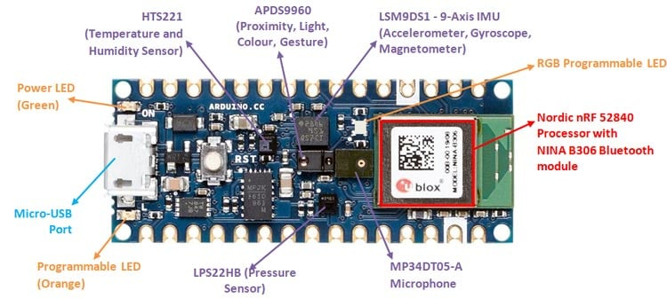
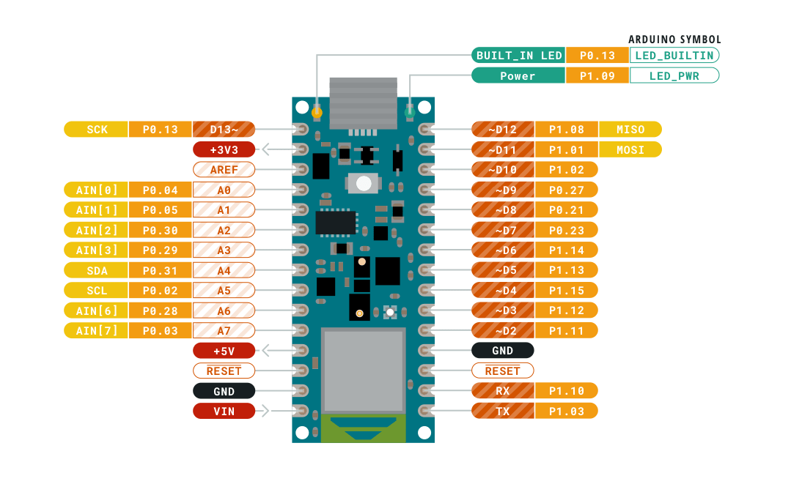

# Arduino NANO 33 BLE Sense

## FAQ
* Can it join Wi-Fi? No, it only does Bluetooth.
* Can you store data? No, the bootloader prevents access to the flash memory.
* Can it be used with micro/cicruit python?
* Is the word detection any good? Not really, does not have a high accuracy to be useful.

## Notes
* NANO 33 BLE comes with a microphone example: Arduino IDE -> Examples -> PDM -> PDMSerialPlotter.
* NANO 33 BLE is a 3.3V board.
* The 5V pin does not work, see the docs.

## Pinout

## Links
* The most important link is the offical [Getting started with the Arduino NANO 33 BLE Sense](https://www.arduino.cc/en/Guide/NANO33BLESense)
* [Detecting Dog Tricks with ML](https://create.arduino.cc/projecthub/whatsupdog/the-muttmentor-9d9753?ref=part&ref_id=107215&offset=2)
* [Send data over sound](https://create.arduino.cc/projecthub/ChirpDevs/send-data-with-sound-bf7024?ref=part&ref_id=107215&offset=3)
* [Magic Wand](https://create.arduino.cc/projecthub/andri/ai-powered-magic-wand-ab1c90?ref=part&ref_id=107215&offset=5)
